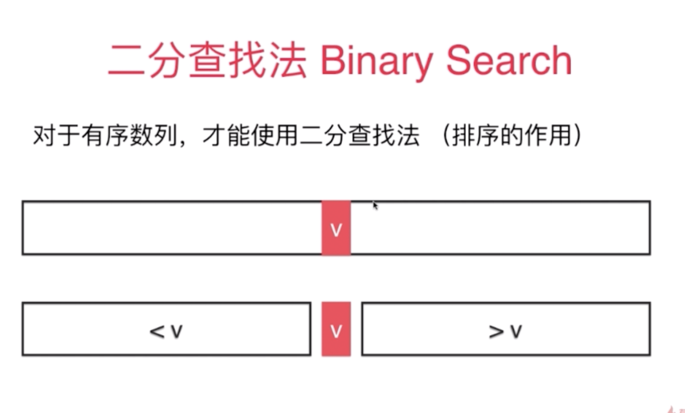

常见数组问题
=======

- 排序：选择排序；插入排序；归并排序；快速排序
- 查找：二分查找法
- 数据结构：栈；队列；堆
- ……

写正确的程序
-------
二分查找法--思想 1946 年出现--正确代码 1962 年出现，所以正确的编写代码非常困难，要注意注意再注意

**处理边界**  
**索引指向**

- 明确变量的含义
- 循环不变量
- 小数据量调试（考虑边界情况）
- 大数据量测试（测试程序性能）

[代码示例](https://github.com/lionztt/algorithm-learning/tree/master/pythonDemo/Array)-》为leetcode上题及其优化  
带有英文名称的为样例题，其余为相关练习题