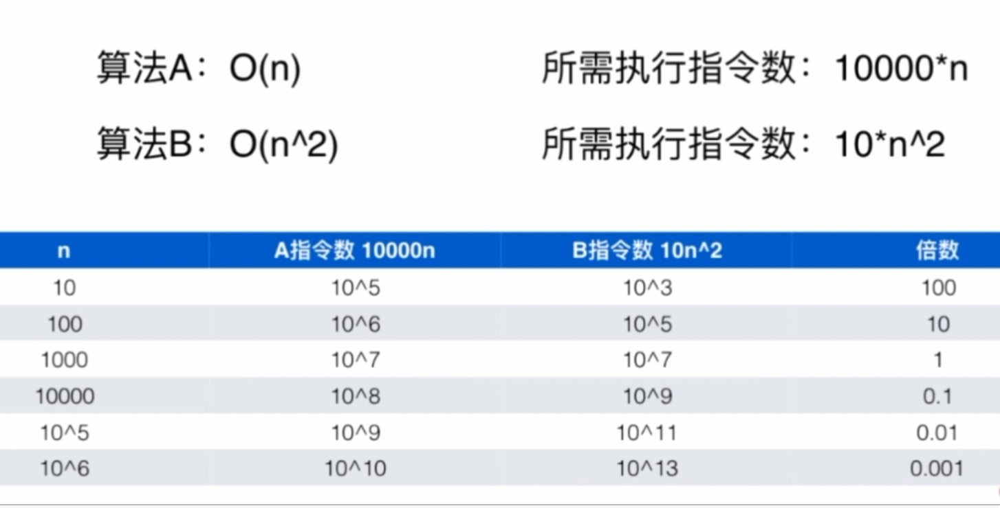
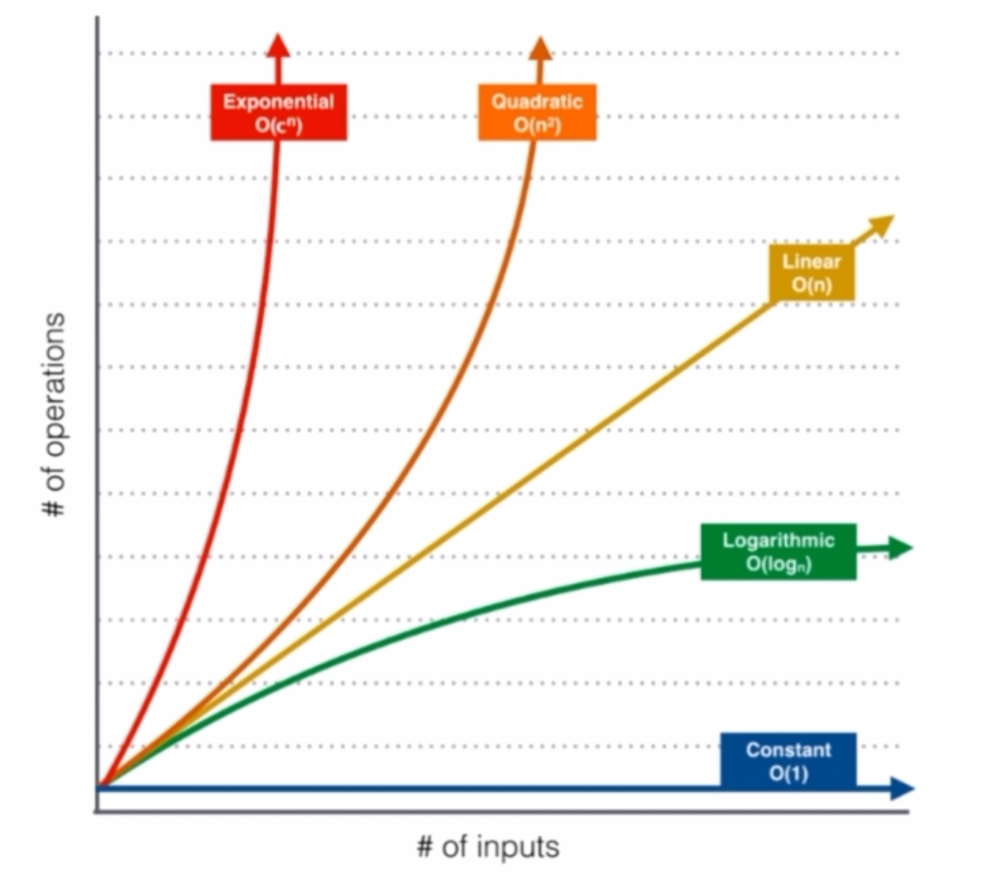
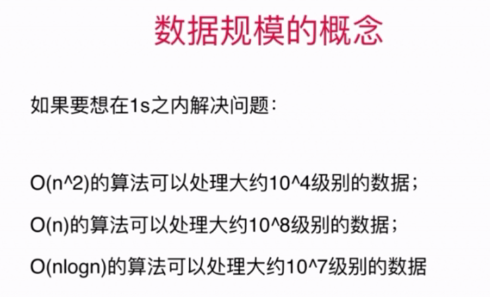

时间复杂度
=========

一. 时间复杂度定义
---------

- n -->表示数据规模
- O(f(n)) -->表示运行算法所需执行的指令数，与f(n)成正比。
- 学术界，严格定义，O(f(n))表示算法执行的上界（比如归并排序时间复杂度既可以是O(nlogn),也是O(n^2)）
- 业界，我们使用O表示算法执行的最低上界

eg: (a/b/c/d都是常数，影响不大)

算法名      | 所需指令数     
-------- | :-----------:  
二分查找法 O(logn) | a*logn 
寻找数组中最大/小值 O(n) | b*n
归并排序法 O(nlogn) | c*nlogn 
选择排序法 O(n^2) |d*n^2 



复杂度高的算法可能有执行数少的优势，数据规模较小时，这种算法是有意义的，  
比如排序算法数据规模较小时都可以转化为插入排序来优化（提升10%～15%）  
这种优化属于细节优化，我们还是要追求时间复杂度低的算法  




二. 时间复杂度性质
--------

1.两段算法的算法时间复杂度的上界由量级较高的算法决定  
**O(nlogn + n) = O(nlogn)**  

当两段算法数据规模不同时，上界不一定由量级较高的算法决定  
**O(AlogA + B) 不一定= O(AlogA + B)**  
例如：邻接表进行遍历-->O(V + E)  

###### 一道小题练练手～  
> 有一个字符串数组，将数组中的每一个字符串按照字符序排序；之后再将整个字符串数组按照字典序排序。整个操作的时间复杂度？  
>&nbsp;&nbsp;&nbsp;&nbsp;答：假设最长字符串长度为s；数组中有n个字符串；  
>&nbsp;&nbsp;&nbsp;&nbsp;&nbsp;&nbsp;&nbsp;&nbsp;&nbsp;&nbsp;&nbsp;&nbsp;对每个字符串排序：O(slogs)  
>&nbsp;&nbsp;&nbsp;&nbsp;&nbsp;&nbsp;&nbsp;&nbsp;&nbsp;&nbsp;&nbsp;&nbsp;将数组中的每个字符串按照字母序排序：O(n * slogs)  
>&nbsp;&nbsp;&nbsp;&nbsp;&nbsp;&nbsp;&nbsp;&nbsp;&nbsp;&nbsp;&nbsp;&nbsp;将整个字符串数组按照字典序排序：O(s * nlogn) *字符串排序比较次数为s*  
>&nbsp;&nbsp;&nbsp;&nbsp;&nbsp;&nbsp;&nbsp;&nbsp;&nbsp;&nbsp;&nbsp;&nbsp;所以： O(n * slogs) + O(s * nlogn) = O(n * slogs + s * nlogn)  

2.算法复杂度在有些情况下是和用例情况相关的  

排序算法表格

算法名称 |最好时间分析|最差时间分析 |	平均时间复杂度 |	稳定度 |	空间复杂度
-------- | :-----------:  | :-----------:  | :-----------:  | :-----------:  | :-----------:  
冒泡排序| O(n)|	O(n^2) |	O(n^2) |	稳定 	|1
插入排序 | O(n)|O(n^2) |	O(n^2) |	稳定 |	1
选择排序 	|	O(n^2) |O(n^2) |	O(n^2)| 	不稳定 	|1
快速排序 |	O(n * log2n)|O(n^2) |	O(n * logn2)| 	不稳定| 	log2n~n
堆排序 |	O(n * log2n) |O(n * log2n) | O(n * log2n)| 	不稳定 |	1
希尔排序 | O(n) |O(n^2) |	O(n^1.3) (不确定) |	不稳定 	|1
归并排序|	O(n * log2n)|O(n * log2n) |	O(n *logn2)| 	稳定| 	n
基数排序|O(d(r+n))|O(d(r+n))|O(d(r+n))|稳定|rd+n

注：   
- r 代表关键字基数，d 代表长度，n 代表关键字个数
- 还有一个桶排序

**我们最关心的还是平均情况**  

三.数据规模的概念
--------


注：
- 这幅图代表的是纯加法运算，所以一些算法比如归并排序，为了保险起见，O(nlogn) 可能要再除以 2～10
- 当数据规模为 10^8 及以上时，我们需要设计一个 O(n) 或者 O(nlogn) 的算法
- 当数据规模为 10^3 时，我们设计一个 O(n^3) 的算法也是可以的

四.空间复杂度
-------

空间复杂度的计算比较简单，所以和时间复杂度放在一起  
- 多开一个辅助数组：O(n)
- 多开一个辅助二维数组：O(n^2)
- 多开常数空间：O(1)（原地排序算法）
- 递归调用有空间代价 = 递归深度

五.递归调用时间复杂度
-------

1. 只进行一次递归调用，且深度为 d，在每个递归函数中时间复杂度为 t，则总体时间复杂度为 O(d*t)
   二分查找 O(logn)

```c++
double pow( double x, int n ){
    assert( n >= 0 );
    if( n == 0 ) return 1.0;
    double t = pow(x, n/2);
    if( n % 2) return x*t*t; //n为奇数会向下取整，所以要乘回来
    return t*t;
}
```
注：计算x^n的快速算法
- 时间复杂度：O(logn)
- 递归深度：logn

2.多次递归调用
```c++
int f(int n){
    assert(n>=0);
    if(n==0) return 1;
    return f(n-1) + f(n-1);
}
```
注：
- 时间复杂度等于二叉树的节点数2^(n+1)-1 *搜索树大小*
- O(2^n)
- 这个算法性能非常非常不好！！！！！指数级问题

归并排序搜索树深度为 logn，每一层处理 n 个数据，整体时间复杂度 O(nlogn)

3.主定理
递归函数所有时间复杂度的计算定理

六.均摊复杂度分析（Amortized Time）
-------


